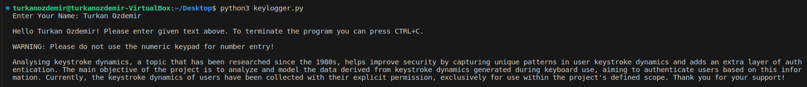
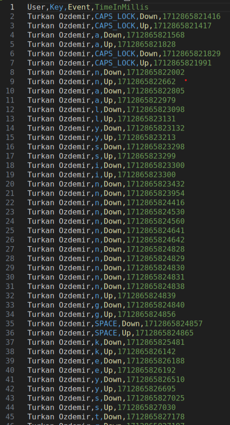
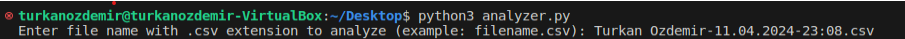
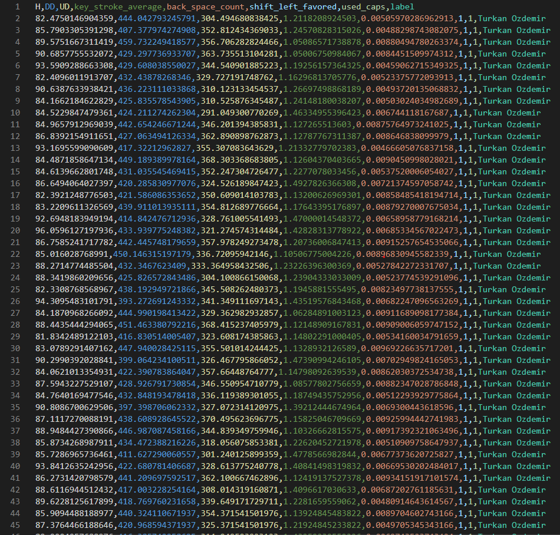

# User Authentication Systems Using Keyboard Keystroke Behaviour

## Overview

User authentication is a process used to verify the identities of users and is of great importance in terms of technology and cyber security today. It is used to enable users to securely access digital systems, accounts or networks. A strong authentication system prevents unauthorized access and ensures data security. However with developing technology, more secure and innovative authentication methods are needed as the weaknesses of traditional password-based methods emerge. New methods such as the use of biometric data, multi-factor authentication and non-password alternatives are being adopted to provide more effective protection against cyber attacks. 

## Project Description

Within the scope of this project, it is aimed to verify the identity of the users by analyzing the "keypress" behavior of keyboard users (keypress durations, inter-key times, etc.). The main purpose of the project is to analyze and model keystroke behavior data generated during keyboard use and to verify user identity using this data.

Key objectives of the project encompass:

- Implementing user authentication systems based on keyboard keystroke behavior.
- Analyzing keystroke datasets using machine learning models for user identification.
- Providing a user-friendly interface (frontend) for data interaction and visualization.

The project consists of the following components:

1. **Keylogger Module**

    - Collects keystroke datasets for analysis.

2. **Models**

    - Responsible for data analysis, prediction models.
    - Utilizes Django as the backend framework.

3. **Keystroke Analyzer**

    - Provides a user interface for uploading data, making predictions, and visualizing results.
    - Developed using React.


## Running System

### Requirements

Following are the most basic software dependencies required to run this project:

- [Ubuntu 22.04](https://ubuntu.com/download/desktop)
- [Python 3.10.x](https://www.python.org/)
- [Node.js](https://nodejs.org/)
- [NPM](https://www.npmjs.com/get-npm)
- [Git](https://git-scm.com/downloads)
- [Visual Studio Code](https://code.visualstudio.com/download) (optinal)

### Steps for Running the system

- Firstly, clone this repository to get the latest using the following command:

```bash
git clone git@github.com:turkanozdemir/user-auth-sys-using-keyboard-keystroke-behaviour.git
```

- Then, follow the next steps for each module.

#### 1. Keylogger Module

Refer to the detailed [README](keylogger) for prerequisites and installation. After all prerequisites are met in this README, the following steps are followed:

1. **Navigate to the `keylogger` directory:**

    ```bash
    cd keylogger
    ```

2. **To capture keystroke dynamics, run the keylogger.py script**

    ```bash
    python3 keylogger.py
    ```
    - When the keylogger.py script is run, the user is expected to enter his/her name first. Then it is expected to enter the text shown in the figure below.

    

    - If there are no errors, the output will be as follows:

    

2. **To analyze the captured keystroke data, run the analyzer.py script:**

    ```bash
    python3 analyzer.py
    ```

    - When analyzer.py is run, the name of the csv file named with username and timestamp created as a result of keylogger.py is expected to be entered.

    


    - If there are no errors, the dataset will be as follows:

    

#### 2. Models (Django)

Refer to the detailed [README](models) for prerequisites and installation. After all prerequisites are met in this README, the following steps are followed.

1. **Navigate to the `models` directory:**

    ```bash
    cd models
    ```

2. **Run the Development Server**

    ```bash
    python manage.py runserver
    ```

3. **Access the API Endpoints**

    The backend will be accessible at `http://localhost:8000`. Use this API to make predictions and generate visualizations.


#### 3. Keystroke Analyzer Frontend (React)

Refer to the detailed [README](keystroke-analyzer) for prerequisites and installation. After all prerequisites are met in this README, the following steps are followed.

1. **Navigate to the `keystroke-analyzer` directory:**

    ```bash
    cd keystroke-analyzer
    ```

2. **Run the Development Server**

    ```bash
    npm start
    ```

3. **Access the Keystroke Analyzer UI**

    The frontend will be accessible at `http://localhost:3000`. Use this UI to upload keystroke data and visualize the results.

    